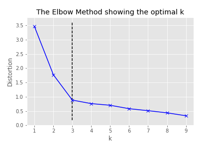

# kneed

## Knee-point detection in Python

[](https://pepy.tech/project/kneed) [](https://pepy.tech/project/kneed) [](https://mybinder.org/v2/gh/arvkevi/kneed/master)  [](https://travis-ci.com/arvkevi/kneed) [](https://www.codefactor.io/repository/github/arvkevi/kneed)

This repository is an attempt to implement the kneedle algorithm, published [here](https://www1.icsi.berkeley.edu/~barath/papers/kneedle-simplex11.pdf). Given a set of `x` and `y` values, `kneed` will return the knee point of the function. The knee point is the point of maximum curvature.


## Installation

To install use:

conda:

    $ conda install -c conda-forge kneed                                                         

pip:                                                               

```
$ pip install kneed
```

Or clone the repo:
```
$ git clone https://github.com/arvkevi/kneed.git
$ python setup.py install
```

**Tested with Python 3.5 and 3.6**

## Usage
*This reproduces Figure 2 from the manuscript.*

`x` and `y` must be equal length arrays.  
`DataGenerator` has functions to generate sample datasets.  
```python
from kneed import DataGenerator, KneeLocator

x, y = DataGenerator.figure2()

print([round(i, 3) for i in x])
print([round(i, 3) for i in y])

[0.0, 0.111, 0.222, 0.333, 0.444, 0.556, 0.667, 0.778, 0.889, 1.0]
[-5.0, 0.263, 1.897, 2.692, 3.163, 3.475, 3.696, 3.861, 3.989, 4.091]

Instantiating `KneeLocator` with `x`, `y` and the appropriate `curve` and `direction` will find the knee (or elbow) point.  
Here, `kneedle.knee` stores the knee point of the curve.

```python
kneedle = KneeLocator(x, y, S=1.0, curve='concave', direction='increasing')

print(round(kneedle.knee, 3))
0.222

# .elbow can also be used to access point of maximum curvature
print(round(kneedle.elbow, 3))
0.222
```

The `KneeLocator` class also has some plotting functions for quick visualization of the curve (blue), the distance curve (red) and the knee (dashed line, if present)

```Python
kneedle.plot_knee_normalized()
```


#### Average Knee from 5000 NoisyGaussians when mu=50 and sigma=10

```python
import numpy as np

knees = []
for i in range(5000):
    x,y = DataGenerator.noisy_gaussian(mu=50, sigma=10, N=1000)
    kneedle = KneeLocator(x, y, curve='concave', direction='increasing')
    knees.append(kneedle.knee)

np.mean(knees)
60.921051806064931
```

## Application

Find the optimal number of clusters (k) to use in k-means clustering.
See the tutorial in the notebooks folder, this can be achieved with the `direction` keyword argument:

```python
KneeLocator(x, y, curve='convex', direction='decreasing')
```



## Contributing

Contributions are welcome, if you have suggestions or would like to make improvements please submit an issue or pull request.                             

## Citation

Finding a “Kneedle” in a Haystack:
Detecting Knee Points in System Behavior
Ville Satopa
†
, Jeannie Albrecht†
, David Irwin‡
, and Barath Raghavan§
†Williams College, Williamstown, MA
‡University of Massachusetts Amherst, Amherst, MA
§
International Computer Science Institute, Berkeley, CA
