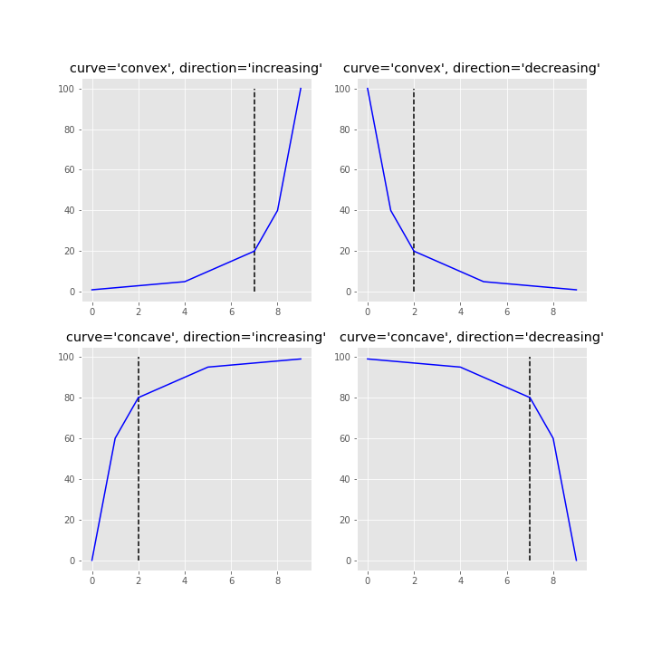
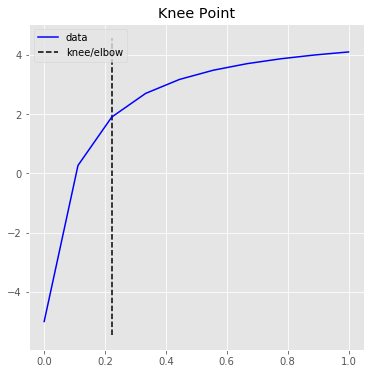
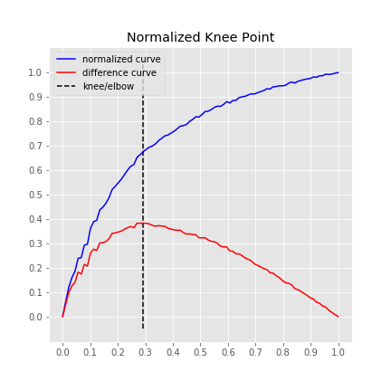
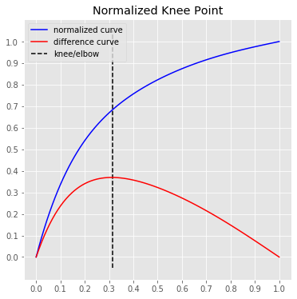

# kneed
 Knee-point detection in Python

[](https://pepy.tech/project/kneed) [](https://pepy.tech/project/kneed)  [](https://mybinder.org/v2/gh/arvkevi/kneed/master)  [](https://travis-ci.com/arvkevi/kneed) [](https://www.codefactor.io/repository/github/arvkevi/kneed)

This repository is an attempt to implement the kneedle algorithm, published [here](https://www1.icsi.berkeley.edu/~barath/papers/kneedle-simplex11.pdf). Given a set of `x` and `y` values, `kneed` will return the knee point of the function. The knee point is the point of maximum curvature.



## Table of contents
- [Installation](#installation)
- [Usage](#usage)
    * [Input Data](#input-data)
    * [Find Knee](#find-knee)
    * [Visualize](#visualize)
- [Examples](#examples)
    * [Sensitivity parameter (S)](#sensitivity-parameter-s)
    * [Polynomial Fit](#polynomial-fit)
    * [Noisy Gaussian](#noisygaussian)
    * [Select k clusters](#select-k-clusters)
- [Contributing](#contributing)
- [Citation](#citation)

## Installation  
> Tested with Python 3.5, 3.6, and 3.7

**anaconda**
```bash
$ conda install -c conda-forge kneed
```

**pip**
```bash
$ pip install kneed
```

**Clone from GitHub**
```bash
$ git clone https://github.com/arvkevi/kneed.git
$ python setup.py install
```

## Usage
These steps introduce how to use `kneed` by reproducing Figure 2 from the manuscript.

### Input Data
The `DataGenerator` class is only included as a utility to generate sample datasets. 
>  Note: `x` and `y` must be equal length arrays.
```python
from kneed import DataGenerator, KneeLocator

x, y = DataGenerator.figure2()

print([round(i, 3) for i in x])
print([round(i, 3) for i in y])

[0.0, 0.111, 0.222, 0.333, 0.444, 0.556, 0.667, 0.778, 0.889, 1.0]
[-5.0, 0.263, 1.897, 2.692, 3.163, 3.475, 3.696, 3.861, 3.989, 4.091]
```

### Find Knee  
The knee (or elbow) point is calculated simply by instantiating the `KneeLocator` class with `x`, `y` and the appropriate `curve` and `direction`.  
Here, `kneedle.knee` and/or `kneedle.elbow` store the point of maximum curvature.

```python
kneedle = KneeLocator(x, y, S=1.0, curve='concave', direction='increasing')

print(round(kneedle.knee, 3))
0.222

print(round(kneedle.elbow, 3))
0.222
```

### Visualize
The `KneeLocator` class also has two plotting functions for quick visualizations.
**Note that all (x, y) are transformed for the normalized plots**
```python
# Normalized data, normalized knee, and normalized distance curve.
kneedle.plot_knee_normalized()
```


```python
# Raw data and knee.
kneedle.plot_knee()
```



## Examples
### Sensitivity Parameter (S)
The knee point selected is tunable by setting the sensitivity parameter **S**. 
From the manuscript:
> The sensitivity parameter allows us to adjust how aggressive we want Kneedle
to be when detecting knees. Smaller values for S detect
knees quicker, while larger values are more conservative.
Put simply, S is a measure of how many “flat” points we
expect to see in the unmodified data curve before declaring
a knee.

```python
import numpy as np
np.random.seed(23)

sensitivity = [1, 3, 5, 10, 100, 200, 400]
knees = []
norm_knees = []

n = 1000
x = range(1, n + 1)
y = sorted(np.random.gamma(0.5, 1.0, n), reverse=True)
for s in sensitivity:
    kl = KneeLocator(x, y, curve='convex', direction='decreasing', S=s)
    knees.append(kl.knee)
    norm_knees.append(kl.norm_knee)

print(knees)
[43, 137, 178, 258, 305, 482, 482]

print([nk.round(2) for nk in norm_knees])
[0.04, 0.14, 0.18, 0.26, 0.3, 0.48, 0.48]

import matplotlib.pyplot as plt
plt.style.use('ggplot');
plt.figure(figsize=(8, 6));
plt.plot(kl.x_normalized, kl.y_normalized);
plt.plot(kl.x_distance, kl.y_distance);
colors = ['r', 'g', 'k', 'm', 'c', 'orange']
for k, c, s in zip(norm_knees, colors, sensitivity):
    plt.vlines(k, 0, 1, linestyles='--', colors=c, label=f'S = {s}');
plt.legend();
```


Notice that any **S**>200 will result in a knee at 482 (0.48, normalized) in the plot above.

### Polynomial Fit
Here is an example of a "bumpy" or "noisy" line where the default `scipy.interpolate.interp1d` spline fitting method does not provide the best estimate for the point of maximum curvature.
This example demonstrates that setting the parameter `interp_method='polynomial'` will choose a more accurate point by smoothing the line.
> The argument for `interp_method` parameter is a string of either "interp1d" or "polynomial".
```python
x = list(range(90))
y = [
    7304, 6978, 6666, 6463, 6326, 6048, 6032, 5762, 5742,
    5398, 5256, 5226, 5001, 4941, 4854, 4734, 4558, 4491,
    4411, 4333, 4234, 4139, 4056, 4022, 3867, 3808, 3745,
    3692, 3645, 3618, 3574, 3504, 3452, 3401, 3382, 3340,
    3301, 3247, 3190, 3179, 3154, 3089, 3045, 2988, 2993,
    2941, 2875, 2866, 2834, 2785, 2759, 2763, 2720, 2660,
    2690, 2635, 2632, 2574, 2555, 2545, 2513, 2491, 2496,
    2466, 2442, 2420, 2381, 2388, 2340, 2335, 2318, 2319,
    2308, 2262, 2235, 2259, 2221, 2202, 2184, 2170, 2160,
    2127, 2134, 2101, 2101, 2066, 2074, 2063, 2048, 2031
]

# the default spline fit, `interp_method='interp1d'`
kneedle = KneeLocator(x, y, S=1.0, curve='convex', direction='decreasing', interp_method='interp1d')
kneedle.plot_knee_normalized()
```


```python
# The same data, only using a polynomial fit this time.
kneedle = KneeLocator(x, y, S=1.0, curve='convex', direction='decreasing', interp_method='polynomial')
kneedle.plot_knee_normalized()
```


### NoisyGaussian
Figure 3 from the manuscript estimates the knee to be `x=60` for a `NoisyGaussian`.
This simulate 5,000 `NoisyGaussian` instances and finds the average.
```python
knees = []
for i in range(5):
    x, y = DataGenerator.noisy_gaussian(mu=50, sigma=10, N=1000)
    kneedle = KneeLocator(x, y, curve='concave', direction='increasing', interp_method='polynomial')
    knees.append(kneedle.knee)

# average knee point
round(sum(knees) / len(knees), 3)
60.921
```

### Select k clusters

Find the optimal number of clusters (k) to use in k-means clustering.
See the [tutorial in the notebooks](https://github.com/arvkevi/kneed/blob/master/notebooks/decreasing_function_walkthrough.ipynb) directory.

```python
KneeLocator(x, y, curve='convex', direction='decreasing')
```


## Contributing

Contributions are welcome, if you have suggestions or would like to make improvements please submit an issue or pull request.                             

## Citation

Finding a “Kneedle” in a Haystack:
Detecting Knee Points in System Behavior
Ville Satopa
†
, Jeannie Albrecht†
, David Irwin‡
, and Barath Raghavan§
†Williams College, Williamstown, MA
‡University of Massachusetts Amherst, Amherst, MA
§
International Computer Science Institute, Berkeley, CA
